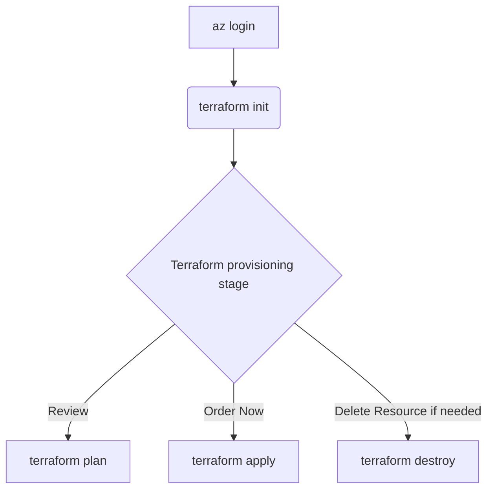

# Terraform Deployment of Azure Resources for the Workshop

> This repository contains Terraform configurations for setting up Microsoft Fabric Capacity and an SQL Server with a database on a public network, which are essential resources for this workshop.

> **Tip**
> About Infrastructure via Terraform, Terraform is an infrastructure as code (IaC) tool that allows you to define and provision your infrastructure using a high-level configuration language. This approach enables source control of the infrastructure itself, allowing you to manage not only the solution code but also the connections and configurations. By using Terraform, you can ensure a consistent and reproducible environment for your deployments, automate infrastructure provisioning, and maintain version control over your infrastructure changes. `Also, Microsoft provides other IaC tools such as Bicep and ARM templates. Bicep is a domain-specific language that uses declarative syntax to deploy Azure resources, offering a concise and easy-to-read alternative to JSON-based ARM templates. ARM templates are JSON files that define the infrastructure and configuration for your Azure solution. These tools provide flexibility and options to suit different preferences and requirements for managing Azure resources.`

<p align="center">
    
</p>

<details markdown="1">
<summary><b>List of References </b> (Click to expand)</summary>

- [Standard Module Structure](https://developer.hashicorp.com/terraform/language/modules/develop/structure)
- [Microsoft Fabric - Terraform (AzAPI provider) resource definition](https://learn.microsoft.com/en-us/azure/templates/microsoft.fabric/capacities?pivots=deployment-language-terraform)
- [Fabric Terraform Quickstarts](https://github.com/microsoft/fabric-terraform-quickstart/tree/main)

</details>

<details markdown="1">
<summary><b>Table of Content </b> (Click to expand)</summary>

- [Overview](#overview)
- [Finding admin_principal_id Using Azure CLI](#finding-admin_principal_id-using-azure-cli)
- [How to execute it](#how-to-execute-it)

</details>

## Overview

```
.
├── README.md
├── src
├────── main.tf
├────── variables.tf
├────── provider.tf
├────── terraform.tfvars
├────── remote-storage.tf
├────── outputs.tf
```

- main.tf `(Main Terraform configuration file)`: This file contains the core infrastructure code. It defines the resources you want to create, such as virtual machines, networks, and storage. It's the primary file where you describe your infrastructure in a declarative manner.
- variables.tf `(Variable definitions)`: This file is used to define variables that can be used throughout your Terraform configuration. By using variables, you can make your configuration more flexible and reusable. For example, you can define variables for resource names, sizes, and other parameters that might change between environments.
- provider.tf `(Provider configurations)`: Providers are plugins that Terraform uses to interact with cloud providers, SaaS providers, and other APIs. This file specifies which providers (e.g., AWS, Azure, Google Cloud) you are using and any necessary configuration for them, such as authentication details.
- terraform.tfvars `(Variable values)`: This file contains the actual values for the variables defined in `variables.tf`. By separating variable definitions and values, you can easily switch between different sets of values for different environments (e.g., development, staging, production) without changing the main configuration files.
- remote-storage.tf `(Remote state storage configuration)`: Terraform uses a state file to keep track of the resources it manages. This file configures remote state storage, which allows you to store the state file in a remote location (e.g., an S3 bucket, Azure Blob Storage). Remote state storage is crucial for collaboration and ensuring that the state file is not lost or corrupted.
- outputs.tf `(Output values)`: This file defines the output values that Terraform should return after applying the configuration. Outputs are useful for displaying information about the resources created, such as IP addresses, resource IDs, and other important details. They can also be used as inputs for other Terraform configurations or scripts.

## Finding `admin_principal_id` Using Azure CLI

> The `admin_principal_id` is typically the Object ID of a user, group, or service principal in Azure Active Directory (AAD). You can find this ID in the Azure portal or by using the Azure CLI.

Get the Object ID of list of Users:

```sh
az ad user list --query "[].{Name:displayName, ObjectId:id, Email:userPrincipalName}" --output table
```


Here is an example value for `admin_principal_id` which is Object ID you retrieved.

```hcl
admin_principal_id = "12345678-1234-1234-1234-1234567890ab"
```

## How to execute it 


> **Important**
> Modify `terraform.tfvars` with your information, then run the following flow. The template uses an F64 Fabric capacity SKU. After the workshop, pause the capacity or delete the resource group to control costs.

### 1. Log in to Azure

This command logs you into your Azure account. It opens a browser window where you can enter your Azure credentials. Once logged in, you can manage your Azure resources from the command line.

```sh
cd ./Terraform-IaC/src/
az login
```


### 2. Initialize Terraform

Initialize the working directory containing the Terraform configuration files. This downloads the required provider plugins and sets up the state backend.

```sh
terraform init
```


### 3. Provision infrastructure

#### Review the plan

Create an execution plan that shows the changes Terraform will make using the values in `terraform.tfvars`.

```sh
terraform plan -var-file terraform.tfvars
```


#### Apply the configuration

Apply the changes required to reach the configured state. Terraform prompts for confirmation before making changes and uses the values in `terraform.tfvars`.

```sh
terraform apply -var-file terraform.tfvars
```


#### Remove the infrastructure

Destroy the infrastructure managed by Terraform when it is no longer needed. Terraform prompts for confirmation and uses the values in `terraform.tfvars`.

```sh
terraform destroy -var-file terraform.tfvars
```


